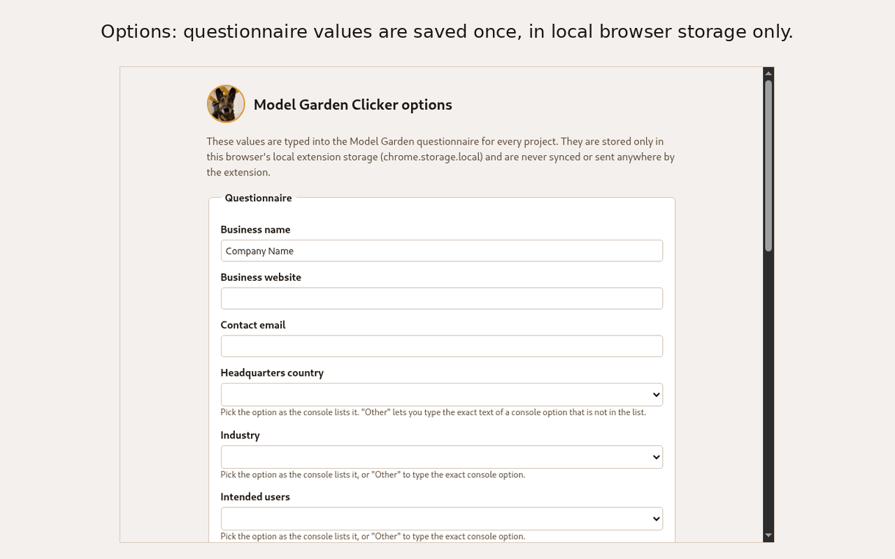
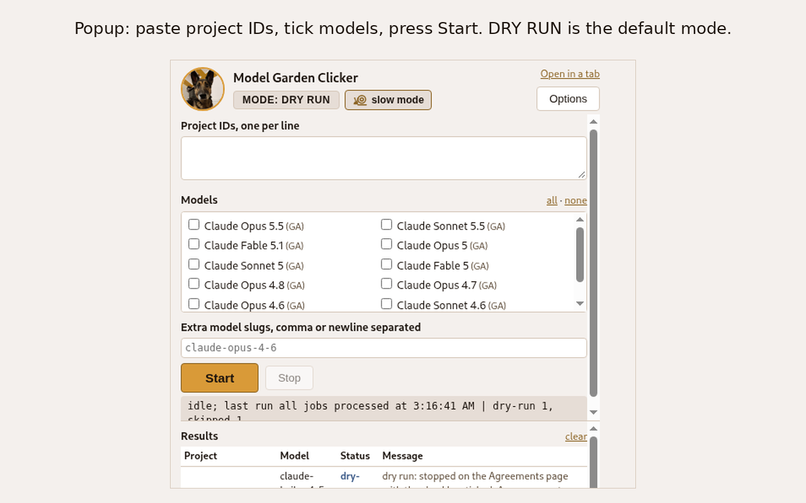
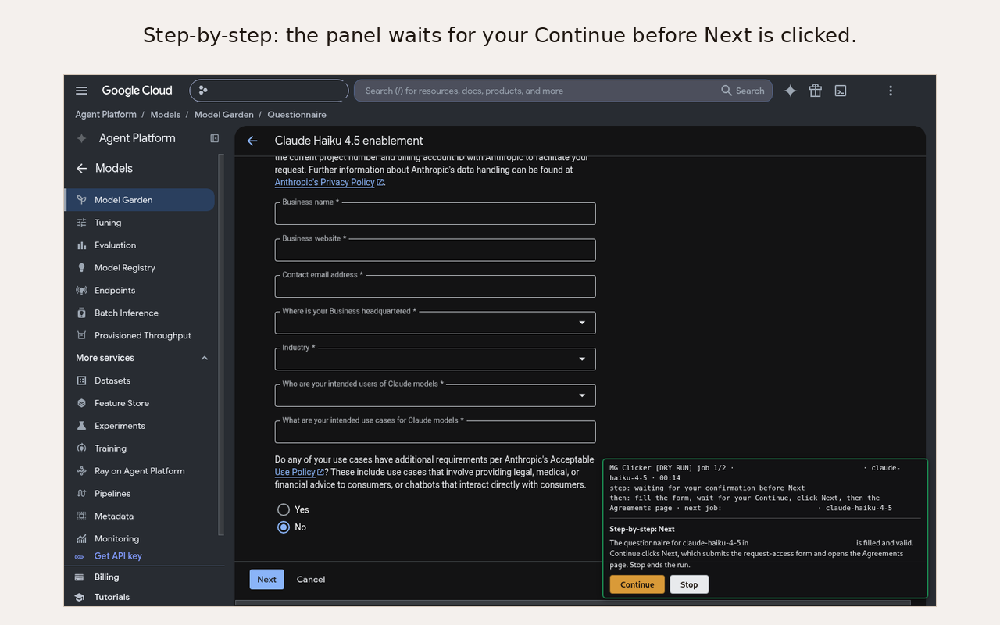
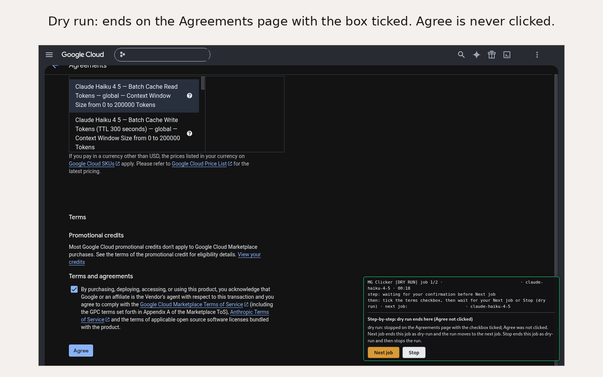
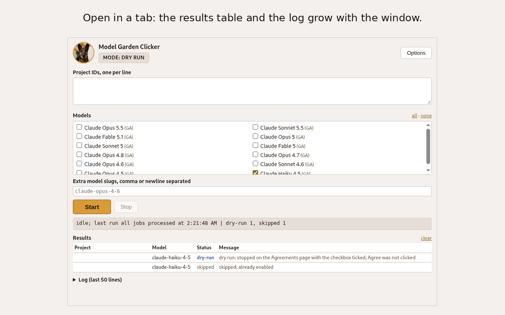
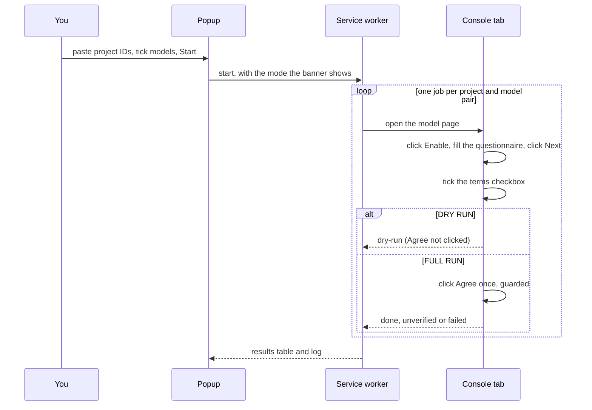

<p align="center"></p>

# Model Garden Clicker

Model Garden Clicker is a Chrome extension that enables Anthropic Claude models in the Google Cloud console Model Garden for many projects. Enabling a model means filling the enablement questionnaire and accepting the Marketplace agreement, once per project and per model. Google Cloud offers no API for this flow as of October 2026, so the extension drives the console pages in your own signed-in browser: you save the questionnaire values once, paste the project IDs, tick the models and press Start.

## See it work

One dry run, from the first click to the results table.

### 1. Save the values once

Open the options page (the **Options** button in the popup, or right-click the extension icon). Fill the questionnaire fields and click **Save**. The values are typed into every questionnaire from now on. They live in this browser's local extension storage (`chrome.storage.local`) and nowhere else.



### 2. Pick projects and models, press Start

Click the extension icon. The header shows the mode, **MODE: DRY RUN** by default, and the step-by-step setting next to it (**slow mode** with a snail icon when it is on, **kubardy mode** with a warning-sign icon when it is off; both are buttons). Paste project IDs, one per line. Tick the models. Press **Start**.



One console tab opens and the jobs run in order, one project and model pair at a time. A dark badge in the bottom-right corner of that tab shows what is going on, updated every second:

```text
MG Clicker [DRY RUN] job 2/4 · my-project · claude-haiku-4-5 · 00:37
step: waiting for Enable button · 12 s / 60 s
then: click Enable, then the questionnaire · next job: my-project · claude-sonnet-4-6
```

Leave that tab alone while a run is active. The extension refuses to act on a page that is not the job's project, and a job whose page changed under it ends `failed`.

### 3. Step-by-step: the panel waits for you

With **Step-by-step confirmation** on, the extension fills a page and then stops. The badge becomes a panel with **Continue** and **Stop**: before Next on the questionnaire, and before Agree in a full run. Press Continue and the extension clicks the button; click the console's own button instead and the extension notices and carries on. The watchdog is paused while the panel waits, so taking your time never fails the job.



### 4. A dry run ends on the Agreements page

The job clicks Enable, fills the questionnaire, clicks Next, checks that the Agreements page is its own (project, product and exact model version), ticks the terms checkbox and stops. Agree is never clicked in a dry run. The job ends `dry-run`. With step-by-step on, the panel ends with **Next job** and **Stop** instead of moving on by itself.



### 5. Read the results

The popup lists one row per job. **Open in a tab** shows the same page in a normal tab, where the table and the log grow with the window.



| Status | Meaning |
|---|---|
| `dry-run` | Stopped on the Agreements page with the checkbox ticked; Agree not clicked. |
| `done` | Full run: Agree clicked and the console's "Successfully purchased" dialog seen. |
| `unverified` | Full run: Agree clicked, no confirmation seen in time. Check that project by hand. |
| `skipped` | The model was already enabled in that project, or an earlier run recorded the pair as done. |
| `failed` | The reason is in the message: a rejected field, a page that was not the job's, a timeout, a console error dialog. |
| `stopped` | You pressed Stop, or the extension was reloaded during the run. |

The log under the table keeps the last 50 lines, with the milliseconds since the job started on every step. Every run's full log is kept on the **Runs** page (the link in the popup's header): every line, with the run's start, end, mode, jobs and results, downloadable as a text file, for the last 50 runs by default (the "Runs to keep" setting in the options page). See [`extension/README.md`](extension/README.md), "The Runs page".

## What a job does



If the console opens its "Enable APIs" dialog (the Agent Platform API is not enabled in the project yet), the extension clicks that dialog's Enable button, waits for it to close and continues. Some model pages need a manual consent step before Enable works; such a job ends `failed` with a message that names the step.

## Modes

**DRY RUN** is the default and the box is ticked in the options page. The job stops on the Agreements page with the checkbox ticked. Nothing is approved, purchased or enabled. Use it to check that the form is filled the way you want.

**FULL RUN** is the box unticked (or the popup banner switched, which asks for a confirmation). Starting a run asks once more. The extension then clicks Agree once per job. Agree accepts the publisher's terms and makes a Marketplace purchase that bills the project. The click only happens when every line below holds:

```text
click Agree only when
  the run was started as FULL RUN and the setting did not change since
  the page is /marketplace/agreements/anthropic/... with the job's ?project=
  the product id equals the one recorded from the questionnaire URL
  the Purchase summary names the job's model, exact version
  the terms checkbox is verified ticked
  no console dialog is open
  step-by-step on: you pressed Continue for this step within 5 minutes
  -> one click per job, never a second one
```

**Step-by-step confirmation** works in either mode (see step 3 above). The two settings can be switched in the options page or from the popup's header, never while a run is active.

Every detail of the popup, the options page, the step-by-step panel and the advanced timing settings is in [`extension/README.md`](extension/README.md).

## Install

**From the release ZIP.** Download `model-garden-clicker-<version>.zip` from the [GitHub releases](https://github.com/pepsi133/model-garden-clicker/releases) and unzip it. Open `chrome://extensions`, turn on **Developer mode**, click **Load unpacked** and pick the unzipped folder. Pin the icon from the extensions menu.

**From a clone.** The same steps, picking the `extension/` folder of the repository. There is no build step. After editing a file, click the reload icon on the extension's card.

**From the Chrome Web Store.** Once the listing is published, the store page installs it with one click; the link will be added here.

Sign in to the Google Cloud console in the same Chrome profile with an account that can enable models in the projects you list.

## Safety

- Dry-run mode is the default. In dry-run mode the extension never clicks Agree.
- A full run (the DRY RUN box unticked, or the popup banner switched to MODE: FULL RUN) clicks Agree and makes Marketplace purchases that bill the project. It asks for a confirmation when you press Start.
- Agree is clicked through one guarded function and at most once per job; the offline tests check that no other code path reaches the button.
- The extension stores values only in local browser storage. It does not sync values to an account and sends nothing to the developer or to anyone else.
- The extension asks for host access to the console origin only (`https://console.cloud.google.com/*`) plus `storage` and `alarms`; the install prompt mentions no browsing history.
- Read [`PRIVACY.md`](PRIVACY.md) for the privacy policy.

## Repository map

```text
model-garden-clicker/
├── extension/            # the Chrome extension (Manifest V3, no build step); README.md is the user manual
│   ├── background/       # service worker: queue, worker tab, run id, watchdog
│   ├── content/          # page handlers; selectors.js holds every console locator
│   ├── popup/ options/ runs/  # the three pages; common/ holds constants, option lists, the per-run log module (runlog.js) and the theme
│   └── test/             # offline tests that run against recorded console pages
├── python/               # Selenium harness: records the console pages and runs the extension end to end
├── docs/                 # dom-map.md (the console DOM), MAINTENANCE.md, models.md, BACKLOG.md
├── store/                # Chrome Web Store listing text, icon, screenshots, checklist
├── scripts/              # build-extension-zip.sh (the store package), icon-palette.py (the theme)
└── PRIVACY.md            # privacy policy
```

## When the console changes

The console DOM was recorded on 2026-10-07. Selectors can break when Google changes the console pages; a locator that no longer matches makes the job fail cleanly instead of guessing. [`docs/MAINTENANCE.md`](docs/MAINTENANCE.md) is the repair guide: record the new pages with the harness, compare them with `docs/dom-map.md`, update `extension/content/selectors.js`, run the offline suite against the new dumps, run one browser dry run, bump the version and tag.

## Changelog

Every version's changes are listed in [`CHANGELOG.md`](CHANGELOG.md).

## License

This repository uses the Apache License, Version 2.0. Read `LICENSE` for the full text. Model Garden Clicker is an independent tool and is not affiliated with, endorsed by or supported by Google or Anthropic.
